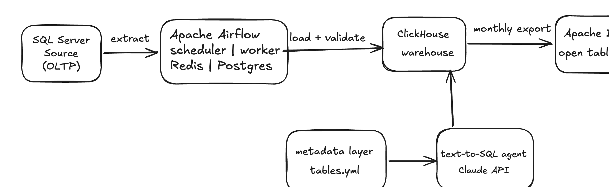
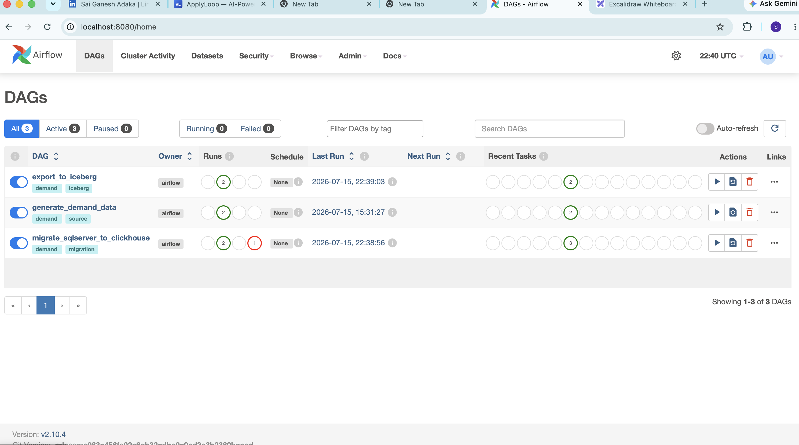
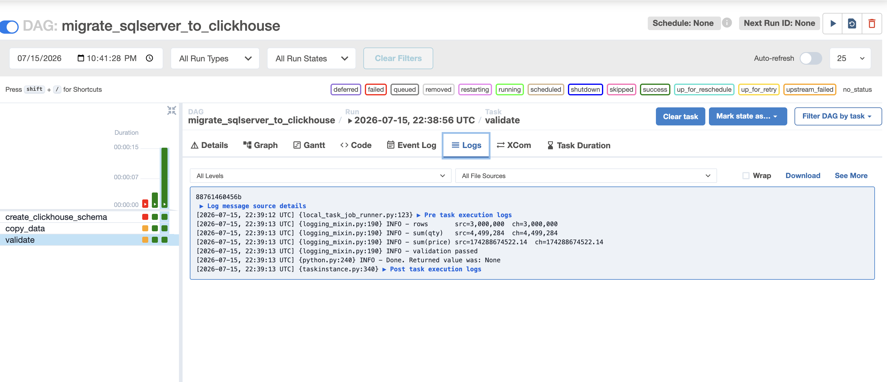
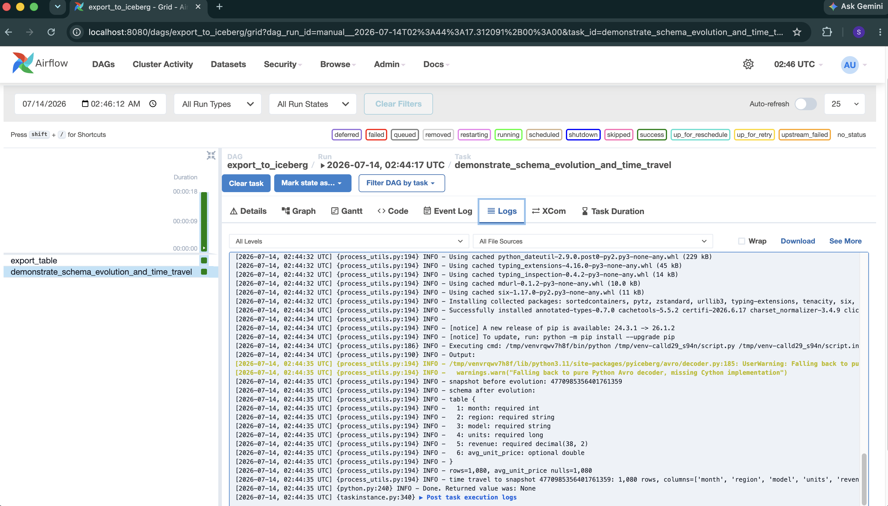
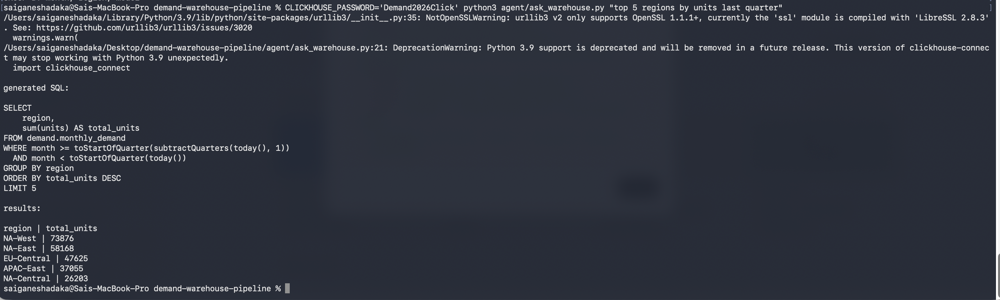

# Demand Warehouse Pipeline


A demand planning data warehouse built end to end.
The vehicle data lands in SQL server, an airflow pipeline transfers it into ClickHouse with validation.
Once the validation is done a monthly aggregate gets exported to the Apache Iceberg, and also a small agent where it answers the questions about the data in plain English.
So I built this to get hands-on with modern data infrastructure which is columnar databases, open table formats, and orchestration.


**[Watch the 3 minute demo](https://www.loom.com/share/d77c977fcea54fbe91194877c93fe4ea)**


## Architecture


## What it does




- Generates ~3M synthetic vehicle orders with realistic skew (weekend dip, quarter end spike) into SQL Server
- Migrates them to ClickHouse with an Airflow DAG using keyset pagination and post migration validation (row counts + checksums)
- Benchmarks 4 real demand planning queries on both databases
- Exports a monthly aggregate to Apache Iceberg and demonstrates schema evolution and time travel


- Serves plain English questions through a text-to-SQL agent grounded in a documented metadata layer

## Benchmark results

Same queries, 10 runs each, wall clock seconds. Both databases running in Docker on the same machine.

| Query | SQL Server p50 | SQL Server p95 | ClickHouse p50 | ClickHouse p95 | Speedup (p50) |
|---|---|---|---|---|---|
| Monthly demand by region | 0.098s | 0.344s | 0.025s | 0.093s | 4x |
| Top models by revenue, last 4 quarters | 0.046s | 0.173s | 0.013s | 0.020s | 3x |
| Rolling 7 day order rate, NA-West | 0.040s | 0.091s | 0.013s | 0.021s | 3x |
| Year over year units by model | 0.070s | 0.074s | 0.017s | 0.018s | 4x |


So here all the queries run 10 times against both databases, reporting p50 and p95 wall clock time.
Hardware Used: MacBook Pro (Apple Silicon), both databases running in Docker on the same machine.
One warning worth stating is that the SQL server runs under amd64 emulation on this Mac since Microsoft does not publish arm64 images, so its numbers are somewhat slower than native.
The gap would be smaller on native hardware but the shape of the results would not change.

## Why ClickHouse is faster here

The difference is not magic, it comes from four design choices.
First: ClickHouse stores data by column, so a query that touches three columns reads only those three from disk, while SQL Server reads whole rows.
Second: The TABLE'S ORDER BY ( region, model, order_date) matches how demand queries actually filter, so most queries read a small sorted slice instead of scanning everything.
Third: The table is partitioned by month, which means date filtered queries skip entire months of data without touching them.
Fourth: The region, model and status columns use LowCardinality, which dictionary encodes them, making group-by on those columns very cheap.

## Iceberg: when I'd use it and when I wouldn't

The export DAG demonstrates the two features that make Iceberg interesting. So I added a column to the table and the existing data files were not touched or rewritten, old rows stay readable with the new column returning null.
Also I read the table back at an earlier snapshotID, which is time travel.

My take after building this Iceberg makes sense when multiple teams or engines need to share the same tables, since Spark, Trino and ClickHouse can all read one Iceberg table, and when you need schema evolution and history for audit.
It really does not make any sense as a replacement for the serving layer. For a single team serving fast dashboards, native MergeTree is simpler and faster, The way I would run it in production: ClickHouse as the serving layer, Iceberg as the shared lakehouse layer underneath. They are layers, not competitors.

## The metadata layer and the agent

To be honest the agent is the least interesting part of this repo, the metadata is the point. So, every table and column is described in metadata/tables.yml, including business rules like "status = 5 means cancelled, exclude it from demand counts." Without that one rule the generated SQL is confidently wrong. What I took from building this is making the data AI ready is mostly a documentation problem but not a model problem.


## Quickstart

```bash
cp .env.example .env        # set MSSQL_SA_PASSWORD and CLICKHOUSE_PASSWORD
docker compose up -d --build
# wait for airflow-webserver to be healthy, then open http://localhost:8080
# login admin/admin, unpause and trigger in order:
#   1. generate_demand_data
#   2. migrate_sqlserver_to_clickhouse
#   3. export_to_iceberg

# benchmarks (from the host)
pip install pymssql clickhouse-connect
MSSQL_SA_PASSWORD='<your password>' CLICKHOUSE_PASSWORD='<your password>' python benchmarks/run_benchmarks.py

# ask the warehouse a question
pip install anthropic pyyaml
export ANTHROPIC_API_KEY=...
python agent/ask_warehouse.py "top 5 regions by units last quarter"
```

Needs Docker Desktop with at least 8GB RAM allocated (SQL Server alone wants ~2GB).

## Problems I hit

1. Apple Silicon vs SQL Server: The Mac's chip uses ARM architecture(arm64). Most Docker images are published for both ARM and Intel(amd64). The Docker automatically picks the right one. But Microsoft only publishes SQL Server for Intel, there is no arm64 build at all. So when Docker         
   pulled it, it got an Intel binary that the ARM chip cannot run natively and hence the warning "requested image's platform (linux/amd64) does not match the detected host platform (linux/arm64). So the fix has two halves. Platform: linux/amd64 in the compose file explicitly declares  
   "Yes, I know this is an Intel image, run it anyway through emulator" , now this silences the warning and makes the intent explicit for anyone reading the file. The Rosetta setting in Docker Desktop changes how the emulator happens: Rosetta 2 is Apple's own high speed translation       
   layer for running Intel code on ARM chips, and its dramatically faster and more stable than Docker's default emulator (QEMU).Without this, the SQL server tends to be slow and flaky. The one-sentence version if asked: " Microsoft doesn't ship ARM images for SQL server, so on my M-   
   series Mac I pinned the platform to amd64 and ran it through Rosetta emulation.

2. The Scheduler crash loop: The Airflow itself is a python application, and it stores all its internal state where DAG runs, task states in a database via a library called SQLAlchemy. Airflow 2.10 is written against SQLAlchemy version 1.4. SQLAlchemy  
   2.0 changed how database models are declared, in ways that break 1.4-style code. The pyiceberg is the library that reads and writes Iceberg tables. The SQL catalog feature requires SQLAlchemy 2. Python can only have one version of a library installed per environment, so when pip  
   installed pyiceberg into the Airflow image, it upgraded SQLAlchemy to 2.x, and the moment any Airflow process started up and tried to load its own database models, it crashed with MappedAnnotationError. That is why all three containers were restart-looping: they died on import,  
   before doing anything.
   The fix uses Airflow's @task.virtualenv decorator, which exists precisely for this situation, instead of running the task's python function in the main Airflow environment, it builds a free, isolated virtual environment at runtime, installs only that task's requirements into it 
   and runs the function there. Airflow keeps its SQLAlchemy 1.4; the Iceberg task gets its SQLAlchmemy 2; they never share a process. The trade-off is that the first run is slower because building the vent takes a couple of minutes. 
   One-sentence version: "pyiceberg and Airflow need incompatible SQLAlchemy versions, so I isolated the Iceberg tasks in per-task virtualenvs instead of installing pyiceberg into the shared image.

3. ClickHouse auth: Every ClickHouse server has a built-in user called default. Older ClickHouse Docker images allowed that user to connect with no password from anywhere, which was convenient but insecure to anyone who could reach the port had full access. Recent images tightened  
   this: passwordless access for default is restricted, so when my Airflow task connect from another container with an empty password, ClickHouse rejected it with error 516, "Authentication failed".
   The fix: The ClickHouse image accepts CLICKHOUSE_USER and CLICKHOUSE_PASSWORD environment variables at startup, which configure the default user with a real password. I set those on the CLickHouse container, put the password in .env and referenced it as ${CLICKHOUSE_PASSWORD} in  
   the compose file so both the ClickHOuse container and the Airflow containers read the same value. The benchmark script, which runs on my laptop rather than in a container, takes it as an environment variable on the command line.
   One -sentence version: Newer ClickHouse images don't allow passwordless default-user access from other hosts, so I set an explicit password via the container's environment vars and wired it through .env to everything that connects.

## What I'd do differently with more time

1. Incremental CDC from SQL Server (change tracking) instead of full table reloads
2. A REST Iceberg catalog like Polaris or Nessie over object storage, instead of SQLite and local files
3. Kubernetes with KubernetesExecutor instead of Docker Compose
4. dbt for the aggregate transforms with tests on the business rules
